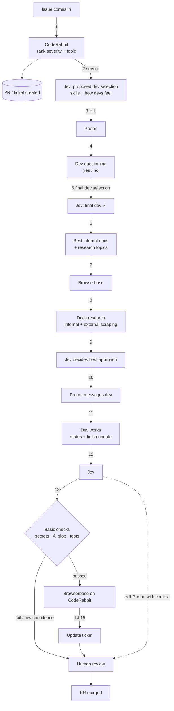

# On-Call Ticket Routing: System Design

> Source: whiteboard session, transcribed 2026-09-26.
> Purpose: context document for humans and coding agents working on this project.
> Items marked **[UNCLEAR]** were hard to read on the whiteboard. Confirm them before relying on them.

---

## 1. Summary

An agentic system for **on-call developers**. When an issue comes in, the system:

1. triages it by severity and topic,
2. picks the best available developer (based on skills *and* how the dev is feeling),
3. researches internal docs and external resources for a recommended fix,
4. messages the developer with that context,
5. checks the resulting pull request for secrets and AI slop, and
6. updates the ticket and hands off to human review for merge.

The orchestrator agent is **Jev**. It *proposes* and routes. Humans make the final calls on dev assignment and merge.

---

## 2. Components / Glossary

| Name | Role | Notes |
|---|---|---|
| **Jev** | Central orchestrator agent | Decides dev selection, picks best research/solution, runs checks, drives the Ralph loop. Proposal only: does not force decisions on humans. |
| **Proton** | Developer communications layer | Messages devs, sends dev surveys/questions, sends documentation, collects status updates. Human-in-the-loop (HIL) touchpoint. |
| **CodeRabbit** | Code review / issue intake | Ranks incoming issues by severity + topic. Reviews PRs. Browserbase interacts with its UI. |
| **Browserbase** | Headless browser automation | Scrapes internal docs and external research; clicks through the CodeRabbit UI. |
| **GMI** | GMI Cloud model inference | Serves Claude Sonnet via its OpenAI-compatible API; Stagehand calls it through `backend/gmi_llm.py`. |
| **Ralph loop** | Iterative agent loop | Jev repeatedly attempts "best steps" with a confidence score until done or below threshold. |
| **HIL** | Human in the loop | Required at dev confirmation and final PR review. |

---

## 3. End-to-End Flow (numbered as on the whiteboard)

| # | From → To | Action |
|---|---|---|
| 1 | Issue → CodeRabbit | Issue comes in. CodeRabbit ranks it by **severity + topic**. A PR/ticket is created. |
| 2 | CodeRabbit → Jev | **Severe** issues are routed to Jev. |
| — | Jev | Jev produces a **proposed dev selection** (skills + how devs are feeling). |
| 3 | Jev → Proton (HIL) | Proposal sent to Proton for human-in-the-loop confirmation. |
| 4 | Proton → Dev | **Dev questioning**: Proton asks the proposed dev(s) about availability and state. Result: dev says yes/no. **[UNCLEAR: "nogs in / dev"]** |
| 5 | Proton → Jev | **Final dev selection** returned to Jev. Final dev confirmed ✓. |
| 6 | Jev | Jev determines the **best internal docs + research topics** for the issue. |
| 7 | Jev → Browserbase | Browserbase is dispatched with those docs/topics. |
| 8 | Browserbase | **Docs research**: scrapes internal docs and external research. |
| 9 | Browserbase → Jev | Research returned. **Jev decides the best** approach. |
| 10 | Jev → Proton | Proton **messages the dev** with the recommended approach + docs. |
| 11 | Dev → Proton | Dev starts working; sends status updates; sends a **finish update** when done. |
| 12 | Proton → Jev | Completion reported to Jev. |
| 13 | Jev | **Basic checks** on the PR: **secrets**, **AI slop** (and testing). |
| 14 | Jev → Browserbase | Checks passed → Browserbase operates **CodeRabbit** (clicks through review in the UI). |
| 15 | Browserbase → Ticket | **Update ticket.** PR marked done → **human review** → merged. Jev calls Proton with context to notify the reviewer. |

---

## 4. Diagram

---

## 5. Jev Behavior Rules

- **Proposal only.** Jev proposes dev selection and solutions. Humans confirm (via Proton) before work is assigned.
- **Dev selection inputs:** abilities/skills, how devs are feeling (surveys via Proton), goal breakdown, relevant documentation.
- **Ralph loop:** Jev iterates on "best steps", attaching a **confidence score** to each.
- **Escalation threshold:** if confidence is below **~80–90%** **[UNCLEAR: exact value]**, or the loop isn't working, escalate to human review. Otherwise continue autonomously.
- **Only send to human review when it isn't working.** Don't flood humans with routine work (the final PR merge review is the exception and always happens).
- **PR checks (step 13):** testing, AI slop, leaked secrets. All must pass before Browserbase proceeds in CodeRabbit.

## 6. Proton Responsibilities

- Send messages to devs
- Run dev surveys / questions (availability, how they're feeling)
- Send documentation and the recommended approach
- Relay status and finish updates back to Jev
- Receive "call with context" from Jev to notify the human reviewer

## 7. Browserbase Responsibilities

- Scrape **internal** docs
- Scrape external **research**
- **Click through the CodeRabbit UI** (review actions, ticket updates)

---

## 8. Project Context: Evaluation Criteria

Written in the top-left corner (appears to be judging criteria):

| Weight | Criterion |
|---|---|
| 25% | **[UNCLEAR]** (reads like "Dev"/"Jev") |
| 25% | AI (anti-slop) |
| 25% | Originality |
| 25% | Technical competence |

---

## 9. Open Questions

1. ~~What is **GMI**'s role in the stack?~~ Resolved: GMI Cloud serves Claude Sonnet.
2. Exact confidence threshold for escalation: 80% or 90%?
3. Step 4 outcome text ("nogs in / dev"): what happens if the dev declines? Presumably Jev re-proposes the next candidate.
4. Are non-severe issues handled at all, or only logged?
5. The first judging criterion in the top-left corner.
